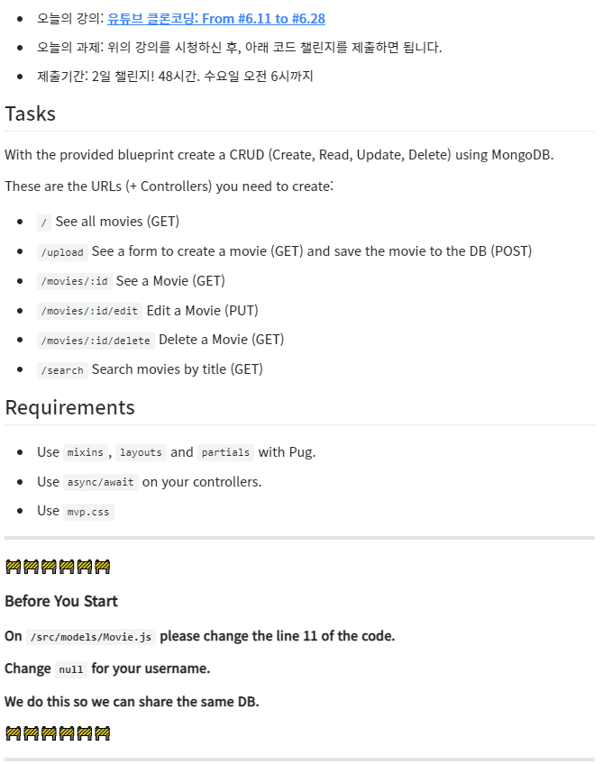

# Mongo II

## 6.11 Our First Query

1. db.js에 db와 관련 없는 부분을 init.js로 분리
2. 외부 데이터베이스를 연동함에 있어 처리 방식 2가지 (callback, promise)

## 6.12 Our First Query part Two

1. call-back을 통한 외부 데이터베이스 비동기처리

## 6.13 Async Await

1. promise(async-await)를 통한 외부 데이터베이스 비동기처리

## 6.14 Returns and Renders

1.  return의 역할 : 본질적인 return의 역할보다는 function을 마무리짓는 역할로 사용되고 있음.
    - 이러한 경우 return이 없어도 정상적으로 동작하지만 실수를 방지하기 위해 return을 사용
2.  render한 것은 다시 render할 수 없음
    - redirect(), sendStatus(), end() 등등 포함 (express에서 오류 발생)

## 6.15 Creating a Video part One

1. document 생성
2. split(문자열 분리), map(해시태그 접두어 삽입)

## 6.16 Creating a Video part Two

1. document를 database에 저장 save()/create()
2. mongoose의 유연한 유효성검증기능, try/catch를 통한 에러처리(계속)
3. mongo console 명령어 show collection(document의 묶음)
4. Schema parameter : required

## 6.17 Exceptions and Validation

1. try/catch를 통한 에러처리, 에러메세지 전달
2. Schema parameter : default
3. Schema CreatedAt에 Date.now()가 아닌 Date.now를 적는 이유 : 생성될때만 실행되도록

## 6.18 More Schema

1. Schema parameter(String only) : minLength, maxLengt, trim, uppercase...
2. mixin(pug) 복습

## 6.19 Video Detail

1. mongoose가 부여한 id를 사용하기 위해 id에 숫자만 사용가능하게 설정한 Router부분 변경
   - http://regexpal.com 을 통한 정규식 생성하기
2. id를 통해 db 내 색인(findById()), 해당 데이터 사용하기

## 6.20 Edit Video part One

1. .exec()에 대한 간략한 설명
2. 사용자가 존재하지 않는 ID에 접근할 경우 => if {404.pug}
3. 일반적으로 에러를 if에 처리, return으로 함수 종료
4. join()으로 배열을 문자열로 통합

## 6.21 Edit Video part Two

1. post 복습
2. postEdit 구현, 일일히 수정 => 안 즐겁다
3. startWith()로 # 유무 확인
4. 조건부 연산자 ?를 통한 간결한 조건문

## 6.22 Edit Video part Three

1. Model.findByIdAndUpdate()로 불러오기와 수정 한방에 => 즐겁다
2. Model.exist()
3. 생성이나 업데이트 전 작동해야할 function의 필요성 => Mongoose의 Middleware 활용

## 6.23 Middlewares

1. DeprecationWarning에 대해.. useFindAndModify: false로 설정하면 해결됨
2. middleware는 무조건 model이 생성되기 전에 만들어야 한다
3. mongoose의 middleware에서 this키워드는 저장하고자 하는 문서를 가리킴
4. middleware에서 해시태그 관리 구현

## 6.24 Statics

1. findByIdAndUpdate()에서는 save 훅업이 발생하지 않음 => 다른 방법을 알아보자
2. Video.js에 function을 만들어서 관리하기 => 이것도 괜찮음 근데 다른것도 알아보자
3. static을 사용하면 import 없이도 Model.function()형태로 사용이 가능함

## 6.25 Delete Video

1. Delete Video 구현
2. Delete는 Remove를 대체하며 충분한 이유가 있지 않은 이상 Delete를 사용

## 6.26 Search part One

1. Model.sort()로 정렬 방식 변경
2. get 메소드에서 form 값을 가져오기 위해서는 req.query 이용

## 6.27 Search part Two

1. Model.find()를 통한 Search
2. 오퍼레이터를 통한 Model.find()의 고도화 (mongoDB)

## 6.28 Conclusions

 
 

# Challenge

- 제출링크 : https://codesandbox.io/s/a11blueprint-forked-td9iu
