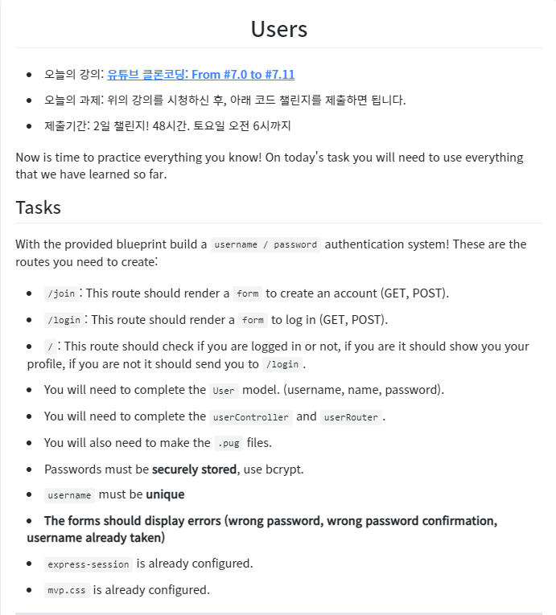

# Users

## 7.0 Create Account part One

1. Authentication에 대해 배워보자
   - email/pw login
   - Github login
2. unique를 통해 중복데이터 방지하기

## 7.1 Create Account part Two

1. DeprecationWarning : 오래된 기능을 사용하고 있다는 경고(에러는 아님)
   - useCreateIndex: true를 추가하여 해당 경고 처리
2. Password를 그대로 저장하면 보안상의 문제 => 해싱.. 다음 강의에

## 7.2 Create Account part Three

1. 암호화 라이브러리 bcrypt 설치
   - 해싱을 통한 단방향 암호화로 패스워드 보안 향상
2. pre('save) 훅업, this에 대해

## 7.3 Create Account part Three

1. 중복데이터로 가입시도시 처리 방법
   - $or operator
2. password confirmation

## 7.4 Status Codes

1. 검증이 실패해도 Status Code 200을 보냄으로 인해 브라우저가 정상적인 상황으로 인식함
   - 400 Bad Request를 통해 브라우저에게 정상적인 상황이 아님을 알려주자

## 7.5 Login part One

1. login page 및 username 존재 여부 체크 구현

## 7.6 Login part Two

1. Compare를 통한 비밀번호 체크

## 7.7~7.8 Sessions and Cookies

1. 세션을 통한 접속된 유저 구분

## 7.9 Logged In User

1. 세션에 로그인한 유저 상태 저장
2. 로그인 상태에서 로그인/Join => Logout

## 7.10 Logged In User part Two

1. locals에 저장한 값은 html에서 불러올 수 있다
2. middleware 파일 생성
3. locals에 현재 로그인 상태 저장, pug에 login/logout 상태별 메뉴 변화 구현

## 7.11 Recap

 
 

# Challenge

- 제출링크 : https://codesandbox.io/s/wetube-13-zqg3b

# Challenge 2

1. Is it OK to save passwords in the database?
   - No, we must save hashes.
2. What does ‘deterministic’ mean in the context of hash functions?
   - It means that the same input will always return the same output
3. I can reverse the hash of a password and get the initial password.
   - No.
4. Is HTTP stateless or stateful?
   - Stateless.
5. What does stateless mean?
   - It means the server does not remember the user across requests.
6. What do we save in the cookies?
   - Session IDs
7. Where are sessions saved by default?
   - Memory
8. Cookies are sent to the backend automatically.
   - Yes.
9. How can I access the session on my controller?
   - req.session
10. All .pug files have access to ‘res.locals’? - Yes
