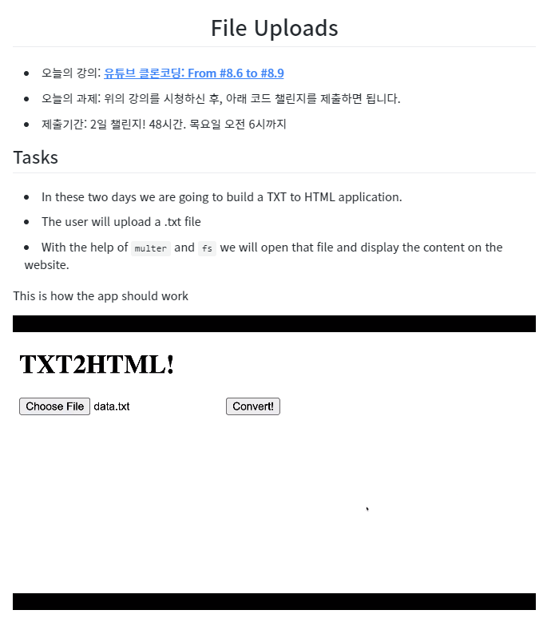

# File Upload

## 8.6 File Uploads One

1. npm i multer
2. form을 multipart/form-data로 인코드
3. multer 사용을 위한 Middleware 생성

## 8.7 File Uploads Two

1. multer 사용을 위한 controller 수정
2. !!DB에는 절대 파일을 저장하지 않는다!! 파일의 위치만 저장한다!!
3. 생성된 avatar 파일의 URL을 만들어준 적이 없기 때문에 안불러와짐.. 다음강의에

## 8.8 Static Files and Recap

1. Router를 생성해줘야 함 server에 app.use("/uploads) 추가
2. 브라우저는 아무 폴더에 접근할 수 없다.. static files serving
   - express.static("uploads") 디렉토리 접근 권한 부여
3. 파일을 server에 저장하지 않고 다른 위치에 저장하기

## 8.9 Video Upload

1. Video Upload
   - 용량제한 걸기

# Challenge

- 제출링크
  - basic : https://codesandbox.io/s/wetube-15-xjqg1
  - advanced : https://codesandbox.io/s/wetube-15-jmwzs
- 솔루션 링크
  - https://codesandbox.io/s/wetube-15soultion-3tr1b
