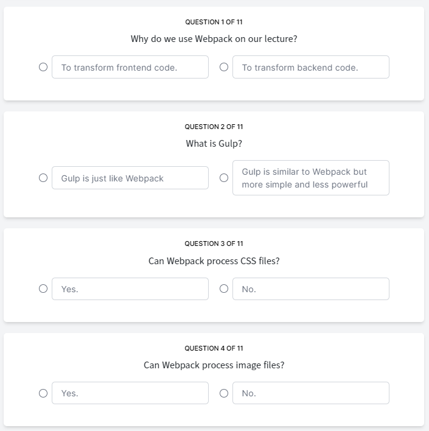

# Webpack Quiz

## 9.0 Introduction to Webpack

1. Webpack이란? 의존성이 있는 모듈들을 하나의 파일로 통합시켜주는 도구
2. gulp란? web팩의 쉬운 대체재
3. 대부분의 프레임워크에는 webpack이 내장되어 있어 직접 세팅할 일이 없으나 이번엔 해볼거임

## 9.1 Webpack Configuration part One

1. npm i webpack webpack-cli -D
   - webpack-cli는 webpack을 console에서 사용할 수 있도록 해줌
2. webpack.config.js파일 생성, 이 파일은 과거 js형식으로 작성할 것
3. entry는 우리가 처리하고자 하는 소스코드(필수)
4. output는 결과물의 경로(필수)
5. webpack을 위한 scirpt

## 9.2 Webpack Configuration part Two

1. output의 path는 절대경로로 입력해야 한다
2. rules 각각 파일의 종류에 따라 어떻게 전환할 것인지 결정하는 규칙
3. loader : rules에 명시된 파일을 변환할 패키지
4. rules에 babel 추가
   - npm i babel-loader -D
5. webpack에게 개발중인지 배포용인지 알려줘야함
   - default는 product.. (배포용)

## 9.3 Webpack Configuration part Three

1. 브라우저는 output에 있는 생성된 파일을 읽음
2. express에서 산출된 폴더를 정적으로 선언해줘야함
   - app.use("/assets", express.static("assets"));
3. view 파일에 script로 추가해주면 산출된 파일을 사용 가능
   - script(src="/static/js/main.js")

